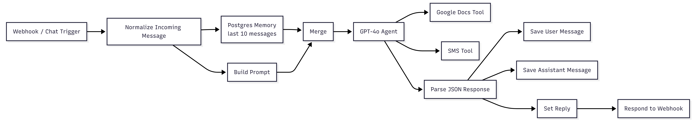
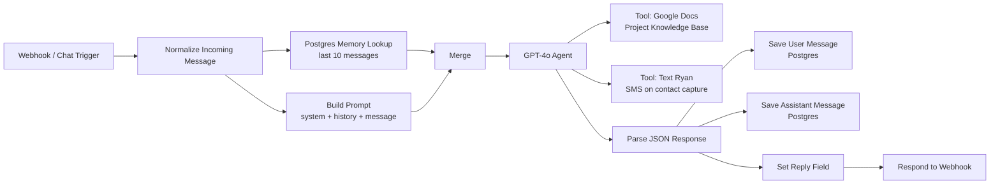

# Conversational AI Lead Qualification System

A production chatbot that qualifies leads, captures contact info, and sends me a real-time SMS notification when someone on my portfolio site shows genuine hiring or project intent.

Built on n8n, GPT-4o, and Postgres. Running live at [ryancarden.com](https://ryancarden.com).

---

## What It Does

When someone visits my portfolio site and starts a conversation, this system:

1. Normalizes the incoming message across multiple payload formats
2. Pulls conversation history from Postgres to maintain session continuity across page refreshes
3. Builds a context-aware prompt combining system instructions, conversation history, and the current message
4. Runs a GPT-4o agent with two tools: a Google Docs knowledge base for project details, and an SMS tool that fires when a visitor provides contact info
5. Parses the structured JSON response — which includes lead score, visitor type, intent classification, and the reply text
6. Saves both sides of the conversation to Postgres for analytics and retraining
7. Returns only the reply text to the frontend

The bot speaks in first person as me. It does not pitch. It qualifies.

---

## Architecture

---

## Key Design Decisions

### Structured JSON output instead of plain text

The agent returns a JSON object on every response — not just the reply string. Fields include `intent`, `visitor_type`, `lead_score` (1–5), `urgency`, and extracted contact info.

This means downstream logic — lead scoring, CRM writes, SMS triggers — happens without a second LLM call. The classification is free because it happens inside the same inference that generates the reply.

The tradeoff is prompt complexity. Enforcing valid JSON output reliably requires explicit output format instructions, examples of correct and incorrect responses, and a parsing layer that handles edge cases. That code is in the `Parse AI Response` node.

### Postgres memory instead of in-memory session state

Conversation history is stored in Postgres and retrieved on every message rather than held in application memory.

This means sessions survive server restarts, the same session can resume across devices or browser refreshes, and the full conversation corpus is available for analytics and future fine-tuning. The cost is one additional database read per message — acceptable at portfolio site volume, worth reconsidering at scale.

### First-person prompt enforcement

The system prompt explicitly prohibits third-person references to me by name. "Ryan has" and "he built" are flagged as wrong in the prompt with correct alternatives shown inline.

The reason: chatbots that refer to their subject in third person feel like brochures. They create distance. A recruiter reading "Ryan has extensive experience" processes it differently than "I've built production RAG systems against live SQL databases." The first sounds like a sales pitch. The second sounds like a conversation.

### Contact capture gated behind demonstrated interest

The bot is instructed not to ask for contact information until the visitor has asked two or more substantive questions, or has explicitly stated hiring or project intent.

Early contact requests read as pushy and reduce conversion. A visitor who has asked two real questions has already demonstrated they're not casual. At that point, the contact offer lands as helpful rather than aggressive.

### SMS notification on contact capture

When a visitor provides a phone number or email, a tool call fires that sends me an SMS with their name, contact info, company, and a summary of what they're looking for.

The intent is response time. A recruiter who leaves their number at 2pm on a Tuesday should hear from a human within 30 minutes. The bot promises that. The SMS makes it possible.

---

## System Prompt

The full system prompt is the core intellectual work of this project. It defines identity, voice, reply rules, tool trigger conditions, and output format. See [system_prompt.md](system_prompt.md) for the complete version with commentary.

---

## What I Would Build Next

**Streaming responses.** The current setup returns the full reply after the agent completes. For longer responses this creates noticeable latency. Streaming would improve perceived responsiveness significantly.

**Intent classification feeding a CRM.** Lead score and visitor type are currently saved to Postgres but not acted on beyond SMS notification. The next step is routing high-score sessions (4–5) into a lightweight CRM with follow-up task creation.

**A/B testing prompt variants against lead score outcomes.** The system prompt has been iterated manually. A more rigorous approach would run two prompt variants in parallel, track lead score distribution across sessions, and promote the higher-performing variant automatically.

**Voice interface.** The same architecture — webhook, agent, structured output, Postgres memory — could support a voice interface via Twilio or similar. The prompt would need adjustments for spoken cadence but the core logic transfers.

---

## Stack

- **Orchestration:** n8n (self-hosted)
- **LLM:** GPT-4o via OpenAI API
- **Memory:** Postgres (persistent chat history)
- **Knowledge base:** Google Docs (retrieved dynamically as a tool)
- **Notifications:** SMS via sub-workflow tool call
- **Frontend:** n8n Chat UI embedded on ryancarden.com
- **Hosting:** Windows Server, Cloudflare Tunnel

---

## Live Demo

The system is running at [ryancarden.com](https://ryancarden.com). The chat widget in the bottom right is this system.
